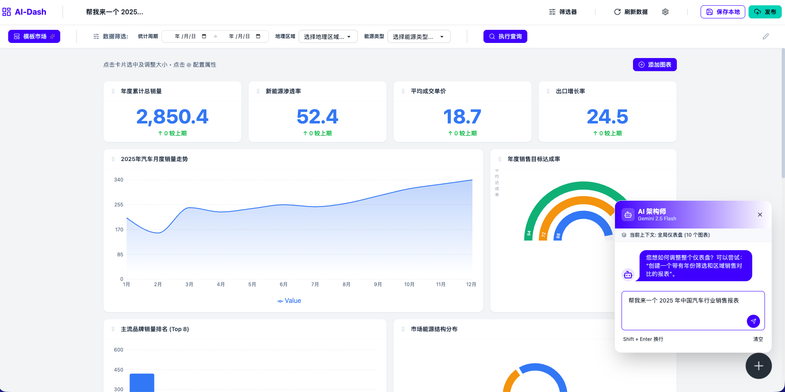

# AI 智能仪表盘系统 (AI-Dashboard)


[🌐 在线演示 (Demo)](https://aidemo.bintelai.com/report/index.html)



一个基于 AI 驱动的现代化报表与仪表盘系统，旨在通过人工智能技术简化数据可视化和分析流程。


## 🌟 核心特性

- **🤖 AI 智能辅助 (AI Copilot)**: 集成 Google Gemini AI，支持通过自然语言对话生成仪表盘、修改组件配置以及进行数据分析。
- **📊 丰富的可视化组件**:
    - 支持多种图表类型：折线图、柱状图、面积图、饼图、雷达图、漏斗图、热力图、散点图、仪表盘等（基于 Recharts）。
    - 强大的表格组件：支持分页、排序、过滤和数据导出。
- **🔌 多样化数据源**:
    - **静态数据**: 直接输入 JSON 数据。
    - **SQL 查询**: 连接数据库并执行 SQL 获取动态数据。
    - **REST API**: 配置 API 接口，支持自定义 Header、查询参数和响应路径映射。
- **🏗️ 拖拽式布局**: 基于 `@dnd-kit` 实现灵活的仪表盘布局，支持自由调整组件位置和大小。
- **🎨 高度可定制**: 每个组件均可配置标题、样式、配色、数据映射及特定图表参数。
- **📱 响应式设计**: 适配各种屏幕尺寸，提供流畅的用户体验。

## 🛠️ 技术栈

- **核心框架**: [React 19](https://react.dev/) + [Vite](https://vitejs.dev/)
- **编程语言**: [TypeScript](https://www.typescriptlang.org/)
- **样式方案**: [Tailwind CSS](https://tailwindcss.com/) + [DaisyUI](https://daisyui.com/)
- **状态管理**: [Zustand](https://github.com/pmndrs/zustand)
- **图表库**: [Recharts](https://recharts.org/)
- **AI 集成**: [Google Generative AI SDK](https://github.com/google-gemini/generative-ai-js)
- **拖拽库**: [@dnd-kit](https://dndkit.com/)
- **图标库**: [Lucide React](https://lucide.dev/)

## 🚀 快速开始

### 1. 克隆项目
```bash
git clone <repository-url>
cd ai-仪表盘
```

### 2. 安装依赖
```bash
pnpm install
```

### 3. 环境配置
在项目根目录创建 `.env` 文件，并配置你的 Gemini API Key：
```env
GEMINI_API_KEY=你的_GEMINI_API_KEY
```

### 4. 启动开发服务器
```bash
pnpm run dev
```

### 5. 构建生产版本
```bash
pnpm run build
```

## 📂 项目结构

```text
src/
├── components/          # 核心组件库
│   ├── report/          # 报表相关组件
│   │   ├── ai/          # AI 辅助功能 (AICopilot)
│   │   ├── charts/      # 图表渲染器
│   │   ├── dashboard/   # 仪表盘管理与编辑器
│   │   ├── services/    # 外部服务 (Gemini API)
│   │   ├── store/       # 状态管理 (Zustand)
│   │   └── types/       # 类型定义
├── pages/               # 页面级组件
├── styles/              # 全局样式
└── App.tsx              # 应用入口
```

## 📖 使用指南

1. **创建仪表盘**: 启动后进入编辑器页面。
2. **添加组件**: 点击“添加组件”按钮，选择所需的图表类型。
3. **配置数据源**: 在组件编辑器中，选择数据源模式（静态/SQL/API），并填入相应的配置。
4. **AI 辅助**: 点击右下角的 AI 图标，唤起 AI 助手，通过对话快速调整仪表盘布局或生成图表。
5. **保存与导出**: 仪表盘配置会自动保存，支持导出为图片或 PDF。

## 🤝 贡献规范


